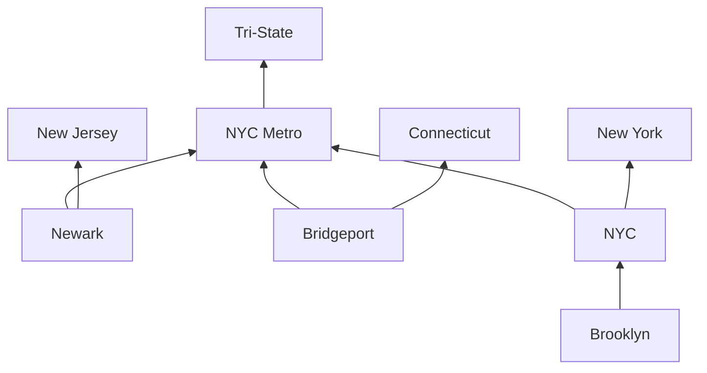
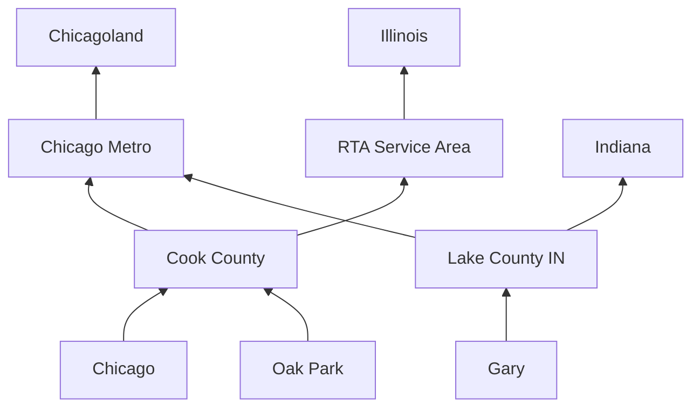
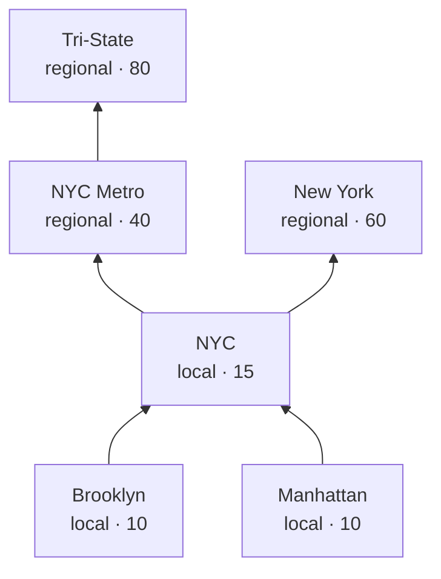
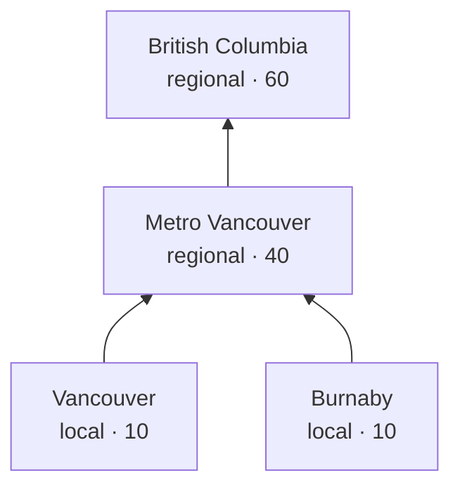
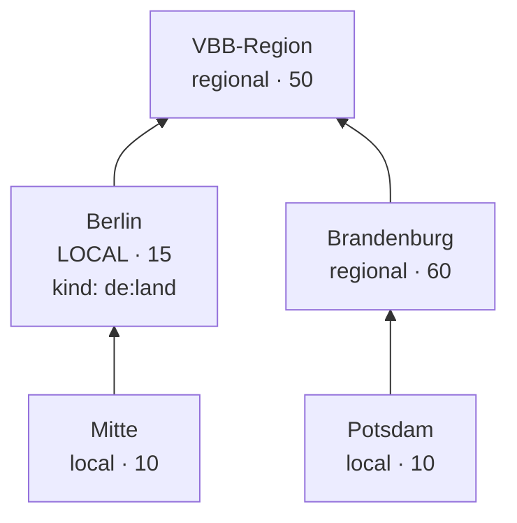

# Region graph

Urbanist Atlas models geography as a **directed acyclic graph of
regions**. Postal codes point at a leaf region; every advocacy
organization attaches to one or more regions. A `/lookup` walks the
graph upward from the leaf to gather every region whose orgs should
surface.

This document is the user-facing reference for curators and new
contributors. The design discussion lives at
[`docs/superpowers/specs/2026-05-16-region-graph-design.md`](./superpowers/specs/2026-05-16-region-graph-design.md);
this doc is shorter and skips the alternatives we considered.

---

## Why a graph

The earlier model put four fixed "tier" foreign keys (city, county,
metro, state) on every postal-code row. That works for US/CA postal
codes, where every ZIP has roughly those four meaningful ancestors.
It breaks for:

- **City-states.** Berlin is a *Land* (state-equivalent) but functions
  as a city. Forcing it into the "state" slot would bucket every
  Berlin org as regional rather than local.
- **Multi-state metros.** NYC spans NY/NJ/CT. If we parent the metro
  under all three states, every Brooklyn lookup would incorrectly
  inherit NJ and CT as ancestors.
- **Transit federations.** Chicago's RTA service area, Berlin's VBB
  Verbund, the NY-NJ-CT Tri-State advocacy region — these are
  real, important regions that don't fit the administrative hierarchy.
- **Variable depth.** Germany has Gemeinde → (Kreis?) → Land. France
  has commune → département → région plus métropoles that overlap
  départements. The UK has town → district → county → region →
  nation. No fixed tier count fits all of them.

The graph handles all of these natively. Each region declares its
direct parents; the lookup walks transitively.

---

## Schema

| Table | Role |
|---|---|
| `regions` | One row per region. `kind` is free-form (`us:city`, `de:land`, `fr:metropole`, …). `scope_tier ∈ {local, regional}` is explicit (not derived from kind). `sort_priority` is a server-side hint for ordering within the Regional bucket. |
| `region_parents` | The DAG edges. Multi-parent allowed; `CHECK` blocks self-loops; longer cycles are caught at `loadregions` time. |
| `postal_codes` | Three columns: `(country, postal_code, leaf_region_id)`. The leaf is the most-specific region a postal code falls under. |
| `organization_regions` | Many-to-many between orgs and regions. Orgs can attach to any node in the graph (leaf city, intermediate metro, multi-state region, transit federation). |

The lookup algorithm: `postal_code → leaf region → recursive CTE up
`region_parents` → set of ancestor region IDs → orgs joined to any of
those IDs → bucket each org by `scope_tier` of its matched regions.

---

## Modeling conventions

These are the things you have to know to model a country correctly.
Without them the graph will produce wrong results.

### 1. State edges live on the leaf, not on the metro

When a metro spans multiple states (NYC across NY+NJ+CT, Chicago
across IL+IN+WI), do **not** parent the metro under each state.
Instead, parent each leaf city directly under its own state.



Why: if `nyc-metro → {ny, nj, ct}`, then a Brooklyn lookup walks
`brooklyn → nyc → nyc-metro → {nj, ct}`, incorrectly inheriting NJ
and CT as ancestors. The walk picks up *all* ancestors transitively.

### 2. Multi-state / federation regions parent the metro or the leaf, not the state

`nyc-tristate` is a parent of `nyc-metro`, not of NY/NJ/CT. The rule:
federations and multi-state regions sit *above* the metro tier (or
directly above leaves), never above the state tier.

Why: if `nyc-tristate → ny`, then a Buffalo ZIP (in NY but not in the
Tri-State advocacy area) would inherit `nyc-tristate` as an ancestor —
wrong.

### 3. Transit federations are siblings of states, parented under the leaves they serve

Chicago's RTA service area covers Cook + 5 collar counties — all in
Illinois. Model it as a top-level region; parent each RTA county
under it. A Cook County lookup walks `cook-county → rta-service-area`;
a Gary IN lookup never touches RTA because Gary's county is parented
under IN, not RTA.



Berlin's VBB similarly: a top-level region; both `berlin` and
`brandenburg` have it as a parent.

### 4. `scope_tier` is editorial, not derived

Berlin is `kind='de:land'` (formally correct) but `scope_tier='local'`
(functionally correct — Berliners experience it as a city). The
maintainer makes this judgment per region.

### 5. No country regions in v1

National orgs are out of scope. The graph stops at state/Land/
multi-state/federation tier — no `us`, `ca`, `de` rows. National orgs
literally have no v1 region to attach to.

### 6. Abstract regions don't need postal codes pointing at them

`nyc-tristate` and `vbb-region` are interior nodes with no postal codes
attached directly. The ancestor walk reaches them through their
children. Orgs attached to abstract regions still surface correctly.

### 7. Sort priority is a hint, not a contract

`sort_priority` orders orgs within the Regional bucket. Lower = more
specific = sorts earlier. Recommended ranges:

| Range | Tier |
|---|---|
| 10 | borough, neighborhood |
| 15 | consolidated city (NYC), city-state acting as city (Berlin) |
| 20 | county |
| 40 | metro |
| 50 | transit federation, RTA-style |
| 60 | state, province, Land |
| 80 | multi-state, multi-province, multi-Land |

These are guidelines. The lookup doesn't care about the specific
numbers — only their relative order.

---

## Worked examples

### NYC (multi-state metro + Tri-State)



**Lookup `11217 US`:**
- Ancestors: `{brooklyn, nyc, nyc-metro, ny, nyc-tristate}`
- **Local:** Brooklyn Spoke, TransAlt, StreetsPAC, Riders Alliance
- **Regional:** TransitCenter (nyc-metro), NY LCV (ny), Tri-State (nyc-tristate)

### Chicago (transit federation IL-only)

See above; the RTA pattern. A Chicago ZIP surfaces RTA-attached orgs;
a Gary IN ZIP doesn't, because Gary's county is parented under IN,
not RTA.

### Vancouver (no county layer)



The model gracefully omits tiers a country doesn't have. CA has no
county equivalent; the graph just doesn't have those nodes.

### Berlin (city-state + transit federation across Länder)



Berlin's `scope_tier='local'` despite `kind='de:land'`. A Berlin lookup
walks `mitte → berlin → vbb-region`. A Potsdam lookup walks
`potsdam → brandenburg → vbb-region`. VBB-attached orgs surface for
both; berlin-attached orgs only surface for Berlin lookups.

---

## Adding a new country

Worked example: Germany.

1. **Write `api/seed/regions_de.toml`.** Start with the Länder, then
   add Bezirke/Kreise as needed, then cities. Set `scope_tier` per
   region using the conventions above. For city-states (Berlin,
   Hamburg, Bremen), use `scope_tier='local'`. Add transit federations
   (VBB, VRR, MVV, …) as top-level regions with the leaves they serve
   as children.

2. **Generate `api/seed/postal_codes_de.csv`.** Take an upstream source
   (OpenGeoDB, Geonames, official Bundespost data), reshape into the
   3-column format `postal_code,country,leaf_region_slug`. Each German
   postcode maps to its leaf city/Gemeinde.

3. **Add DE orgs to `api/seed/orgs.toml`.** Use `region_slugs` to
   attach them. For an org that works across the VBB area, attach to
   `["vbb-region"]`. For a Berlin-wide org, attach to `["berlin"]`.

4. **Run `just loaddata` (after updating the recipe to include the new
   files).** It runs:

   ```sh
   just loadregions seed/regions_de.toml DE
   just loadpostal  seed/postal_codes_de.csv DE
   just seed
   ```

5. **Add a per-country postal normalizer if needed.** Edit
   `api/pkg/atlas/postal.go`. The default normalizer (`uppercase +
   strip whitespace`) works for DE/FR/MX (5-digit numeric). UK and CA
   need special handling (outward code / FSA truncation); those are
   already in place. Australia is 4-digit numeric.

6. **Smoke-test:**

   ```sh
   just lookup 10115 DE     # Berlin-Mitte
   just lookup 14467 DE     # Potsdam
   ```

   The first should return Berlin and VBB orgs in Local + Regional.
   The second should return Brandenburg + VBB orgs in Regional, NOT
   the Berlin-attached orgs.

That's the entire flow. No schema changes; no code changes for
typical countries.

---

## Open vocabulary

`RegionKind` and `Country` are free-form strings on the wire. The
recommended vocabulary uses country-prefixed values:

| Country | Recommended kinds |
|---|---|
| US | `us:borough`, `us:city`, `us:county`, `us:metro`, `us:state`, `us:multi-state`, `us:transit-federation` |
| CA | `ca:city`, `ca:regional-district`, `ca:cma`, `ca:province` |
| DE | `de:bezirk`, `de:kreisfreie-stadt`, `de:kreis`, `de:land`, `de:transit-federation` |
| FR | `fr:commune`, `fr:departement`, `fr:region`, `fr:metropole` |
| UK | `uk:town`, `uk:unitary-authority`, `uk:county`, `uk:region`, `uk:nation` |
| AU | `au:suburb`, `au:lga`, `au:gccsa`, `au:state` |

Clients should treat unknown kinds gracefully — fall back to
displaying `name`.

`scope_tier` is the only closed enum on the wire: exactly `'local'` or
`'regional'`. This is load-bearing for the two-bucket API contract; if
a third tier is ever needed (national, neighborhood) that's a major
version event.
