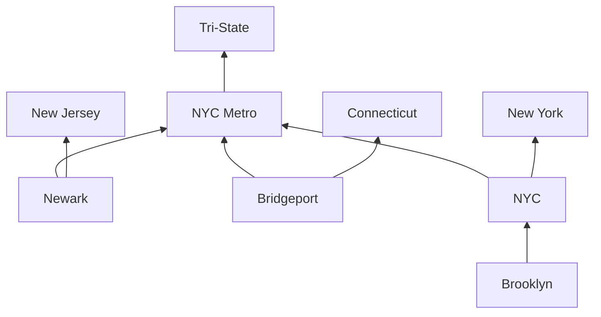
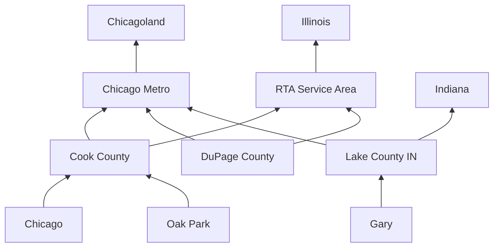
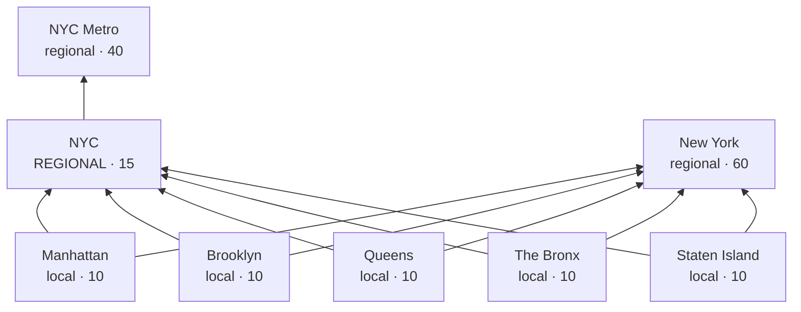
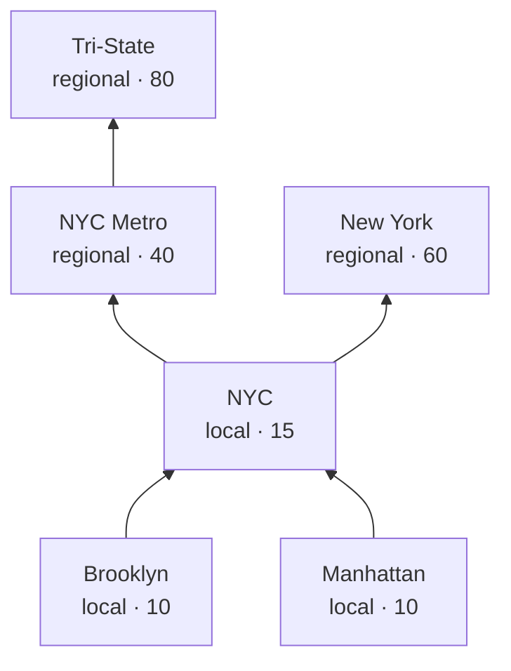
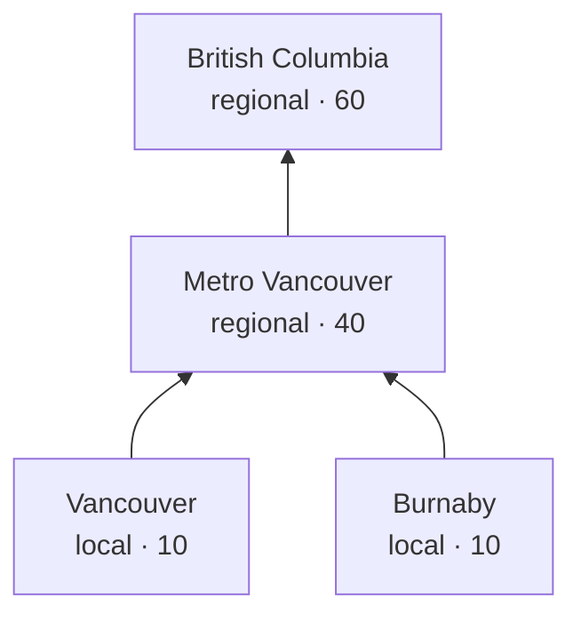
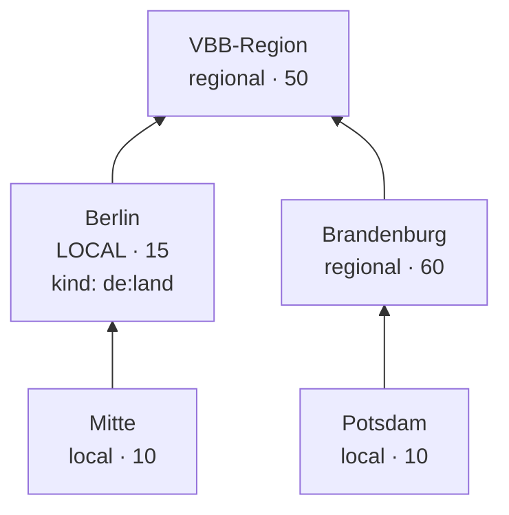
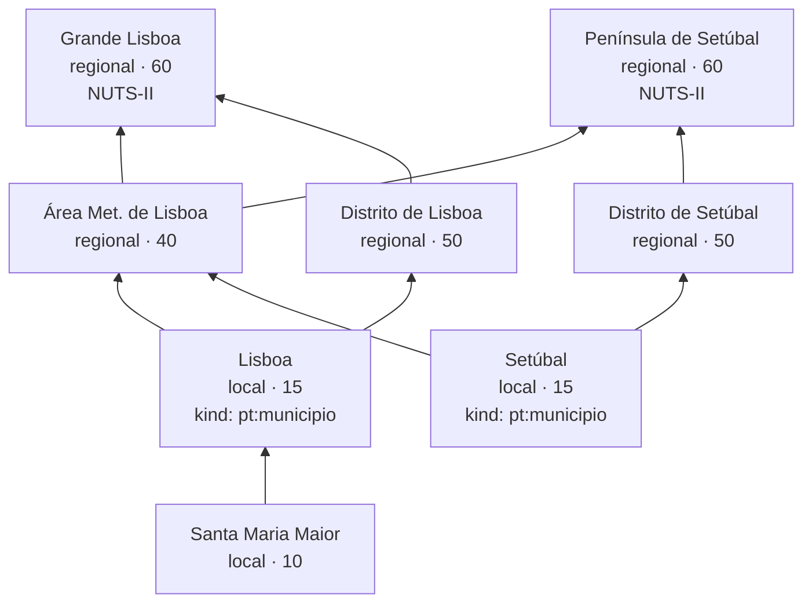
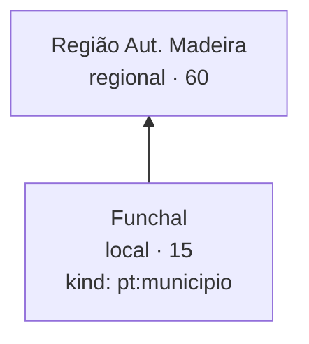
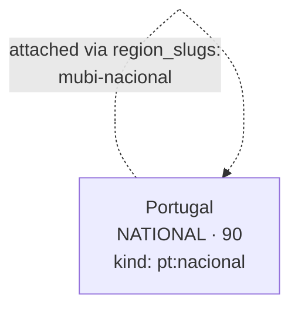

# Region graph

Urbanist Atlas models geography as a **directed acyclic graph of
regions**. Postal codes point at a leaf region; every advocacy
organization attaches to one or more regions. A `/lookup` walks the
graph upward from the leaf to gather every region whose orgs should
surface.

This document is the user-facing reference for curators and new
contributors. The design discussion lives at
[`docs/superpowers/specs/2026-05-16-region-graph-design.md`](./superpowers/specs/2026-05-16-region-graph-design.md);
this doc is shorter and skips the alternatives we considered.

---

## Why a graph

The earlier model put four fixed "tier" foreign keys (city, county,
metro, state) on every postal-code row. That works for US/CA postal
codes, where every ZIP has roughly those four meaningful ancestors.
It breaks for:

- **City-states.** Berlin is a *Land* (state-equivalent) but functions
  as a city. Forcing it into the "state" slot would bucket every
  Berlin org as regional rather than local.
- **Multi-state metros.** NYC spans NY/NJ/CT. If we parent the metro
  under all three states, every Brooklyn lookup would incorrectly
  inherit NJ and CT as ancestors.
- **Transit federations.** Chicago's RTA service area, Berlin's VBB
  Verbund, the NY-NJ-CT Tri-State advocacy region — these are
  real, important regions that don't fit the administrative hierarchy.
- **Variable depth.** Germany has Gemeinde → (Kreis?) → Land. France
  has commune → département → région plus métropoles that overlap
  départements. The UK has town → district → county → region →
  nation. No fixed tier count fits all of them.

The graph handles all of these natively. Each region declares its
direct parents; the lookup walks transitively.

---

## Schema

| Table | Role |
|---|---|
| `regions` | One row per region. `kind` is free-form (`us:city`, `de:land`, `fr:metropole`, …). `scope_tier ∈ {local, regional}` is explicit (not derived from kind). `sort_priority` is a server-side hint for ordering within the Regional bucket. |
| `region_parents` | The DAG edges. Multi-parent allowed; `CHECK` blocks self-loops; longer cycles are caught at `loadregions` time. |
| `postal_codes` | Three columns: `(country, postal_code, leaf_region_id)`. The leaf is the most-specific region a postal code falls under. |
| `organization_regions` | Many-to-many between orgs and regions. Orgs can attach to any node in the graph (leaf city, intermediate metro, multi-state region, transit federation). |

The lookup algorithm: `postal_code → leaf region → recursive CTE up
`region_parents` → set of ancestor region IDs → orgs joined to any of
those IDs → bucket each org by `scope_tier` of its matched regions.

---

## Modeling conventions

These are the things you have to know to model a country correctly.
Without them the graph will produce wrong results.

### 1. State edges live on the leaf, not on the metro

When a metro spans multiple states (NYC across NY+NJ+CT, Chicago
across IL+IN+WI), do **not** parent the metro under each state.
Instead, parent each leaf city directly under its own state.



Why: if `nyc-metro → {ny, nj, ct}`, then a Brooklyn lookup walks
`brooklyn → nyc → nyc-metro → {nj, ct}`, incorrectly inheriting NJ
and CT as ancestors. The walk picks up *all* ancestors transitively.

### 2. Multi-state / federation regions parent the metro or the leaf, not the state

`nyc-tristate` is a parent of `nyc-metro`, not of NY/NJ/CT. The rule:
federations and multi-state regions sit *above* the metro tier (or
directly above leaves), never above the state tier.

Why: if `nyc-tristate → ny`, then a Buffalo ZIP (in NY but not in the
Tri-State advocacy area) would inherit `nyc-tristate` as an ancestor —
wrong.

### 3. Transit federations are siblings of states, parented under the leaves they serve

Chicago's RTA service area covers **Cook + 5 collar counties (DuPage,
Kane, Lake-IL, McHenry, Will) — all in Illinois**. Model it as a
top-level region and parent each of the six RTA counties under it. A
Cook County lookup walks `cook-county → rta-service-area`; a collar
suburb walks `dupage-county → rta-service-area → il`.

This is also the **only** way a collar suburb reaches Illinois
statewide orgs: the state edge lives on the county leaf's ancestry (via
the RTA federation), **not** on the metro. That's mandatory here
because `chicago-metro` spans IL+IN, so per [rule
§1](#1-state-edges-live-on-the-leaf-not-on-the-metro) it must carry no
state edge. A Gary IN lookup never touches RTA or Illinois, because
Gary's county is parented under IN, not RTA — the bi-state metro tier
never leaks IL into Indiana or vice versa.



(DuPage stands in for the five collar counties — each parents under
both `chicago-metro` and `rta-service-area`, mirroring `cook-county`.
Collar ZIPs anchor at the county leaf, since none have a curated city
leaf.)

Berlin's VBB similarly: a top-level region; both `berlin` and
`brandenburg` have it as a parent.

> **Why `chicagoland` and `chicago-metro` are two nodes (and stay
> two).** `chicago-metro` is the ETL-regenerated Census MSA (CBSA
> 16980); `chicagoland` is the hand-curated `us:multi-state` advocacy
> node above it — the same split as `nyc-metro` / `nyc-tristate`. Both
> are `scope_tier=regional`, so they render in a single "Regional"
> section; the split is structural (the ETL boundary, plus a stable
> home for cross-state coalitions), not presentational. Merging them
> was evaluated and declined — it would buy nothing in the UI while
> breaking the NYC parallel and forcing an ETL CBSA suppression.
> `rta-service-area` is likewise retained: it's the IL-only transit
> district (Cook + 5 collar), a genuinely distinct entity from the
> broader bi-state Census metro.
>
> **Residual (deferred).** Census CBSA 16980 nominally includes Kenosha
> County, WI, but Kenosha is modeled as a standalone `kenosha-wi-metro`
> under `wi`, so it does not reach `chicagoland`. Reconnecting it — and
> seeding the outlying non-RTA metro counties (Kendall, Grundy, DeKalb)
> that still anchor at the bare metro — is left to a future slice.

### 4. `scope_tier` is editorial, not derived

Berlin is `kind='de:land'` (formally correct) but `scope_tier='local'`
(functionally correct — Berliners experience it as a city). The
maintainer makes this judgment per region.

The rule of thumb:

> Local = what a resident calls their city or neighborhood.
> Regional = what they call their region, metro, or state.
> National = a country-wide umbrella that doesn't fit into any
> single regional unit.

### 5. The `national` tier exists, but the default lookup filters it

`scope_tier='national'` is a third bucket alongside `local` and
`regional`. National-tier regions are filtered from the default
`/api/v1/lookup` ancestor walk so they don't surface in postal-code
results.

**Per-country editorial policy** (load-bearing — please read before
adding a national region):

- **US / CA: do NOT create `us:national` or `ca:national` regions in
  v1 seed data.** The local-first ethos is the prime directive for US
  and Canadian results. National orgs that have state/provincial
  chapters get modeled as their chapters (e.g. Rail Passengers
  Association → state chapters). National orgs without local presence
  are simply excluded.
- **PT / UK / NL / MX / future countries: create `<cc>:nacional` (or
  `<cc>:national`) only when an org genuinely operates nationally
  without sufficient local presence.** Examples: MUBi national (PT
  cycling federation), Fietsersbond (NL), Living Streets (UK).

**National regions get no incoming parent edges from the leaf chain.**
They live as standalone attachment targets. The default lookup never
reaches them through the ancestor walk; the SQL-level filter in
`AncestorRegions` is defense-in-depth.

**Scale calibration.** The semantic weight of "national" varies by
country scale. A PT-national org (~10M-person country) is closer in
*effective scope and influence* to a US state-level org than to a
hypothetical US-national one. Schema treats `national` uniformly;
editorial judgment about how to *frame* national orgs is per-country.
This informs future UX (a PT user's "national umbrella" feels close,
a US user's would feel distant), not the default display rules.

### 6. Abstract regions don't need postal codes pointing at them

`nyc-tristate` and `vbb-region` are interior nodes with no postal codes
attached directly. The ancestor walk reaches them through their
children. Orgs attached to abstract regions still surface correctly.

### 7. Postal codes anchor at the smallest curated region

`postal_codes.leaf_region_id` is a misnomer — the schema doesn't
constrain that referenced row to be a leaf in the DAG sense. The
recursive ancestor walk works from any region. So the convention is:
**every postal code anchors at the smallest curated region for its
area**, and granularity grows organically per-ZIP as we curate more
leaves.

Resolution priority, applied at seed-time:

```
if curated city leaf exists for ZCTA's place        → anchor = city leaf
elif ZCTA is in an NYC borough county               → anchor = borough leaf
elif ZCTA is in a curated MSA                       → anchor = MSA region
else                                                → anchor = state/province
```

Worked examples:

| Postal code | Anchor       | Why                                                |
|---|---|---|
| 10001 (NYC) | `manhattan`  | NYC borough county = New York County               |
| 94110 (SF)  | `sf`         | SF is a curated city leaf                          |
| 33401 (WPB) | `miami-msa`  | West Palm Beach is in the Miami MSA, no city leaf  |
| 83702 (ID)  | `id` (state) | No leaf, not in a curated MSA; state fallback      |

The lookup-side ancestor walk is unchanged: from whichever anchor the
postal code points at, walk up via `region_parents`, gather ancestors,
join orgs. No app-level fallback logic.

The full design rationale is at
[`docs/superpowers/specs/2026-05-19-postal-coverage-design.md`](./superpowers/specs/2026-05-19-postal-coverage-design.md).

### 8. NYC is the only US city we model sub-municipally at v1

NYC's five boroughs (Manhattan, Brooklyn, Queens, Bronx, Staten
Island) exist as separate leaves under a single `nyc` regional
intermediate region. This is the **only sub-municipal split in the
US seed at v1**.

Three things converge to make NYC structurally splittable:

1. **NYC boroughs are counties.** Manhattan = New York County,
   Brooklyn = Kings County, Queens = Queens County, Bronx = Bronx
   County, Staten Island = Richmond County. The Census ZCTA-to-county
   crosswalk hands us borough resolution for free.
2. **Each borough has distinct civic identity** — Borough President,
   council districts, etc. Most other US "city subdivisions" (LA
   neighborhoods, Chicago community areas, DC wards, Boston
   neighborhoods) lack distinct civic governance.
3. **Borough-specific advocacy ecosystems exist** (e.g., Brooklyn
   Spoke is borough-only). The split gives them a natural
   attachment point.

The DAG shape:



Note: `nyc.scope_tier = regional` even though `kind = us:city` —
similar to Berlin's `kind = de:land` / `scope_tier = local`
exception. The scope_tier-vs-kind decoupling earns its keep here.

The state edge (`ny`) lives on each borough leaf, **not** on `nyc`
itself, per [rule §1](#1-state-edges-live-on-the-leaf-not-on-the-metro).
A Manhattan lookup walks `manhattan → {nyc, ny} → nyc-metro →
nyc-tristate`; the orgs at each tier surface in the right bucket.

**Citywide NYC orgs attach to `nyc`** (regional) — TransitCenter,
Transportation Alternatives, Riders Alliance. **Borough-only orgs
attach to the specific borough leaf** (Brooklyn Spoke → `brooklyn`).
**Metro-wide orgs attach to `nyc-metro`** (Regional Plan
Association).

Other US cities (LA, Chicago, Boston, SF, Miami, etc.) stay as a
single leaf at v1, even where neighborhood identity is strong. The
ZCTA-to-county crosswalk would give them a single shared county, not
neighborhood-level granularity. Promotion to multi-leaf would
require additional editorial work + ZIP-to-neighborhood crosswalks
with fuzzy boundaries. Deferred until org density warrants.

### 9. Sort priority is a hint, not a contract

`sort_priority` orders orgs within the Regional bucket. Lower = more
specific = sorts earlier. Recommended ranges:

| Range | Tier |
|---|---|
| 10 | borough, neighborhood, freguesia |
| 15 | consolidated city (NYC), município, city-state acting as city (Berlin) |
| 20 | county |
| 30 | CIM, regional district |
| 40 | metro, área metropolitana, CMA |
| 50 | transit federation, distrito, RTA-style |
| 60 | state, province, Land, NUTS-II, região autónoma |
| 80 | multi-state, multi-province, multi-Land |
| 90 | national umbrella (only surfaced via opt-in) |

These are guidelines. The lookup doesn't care about the specific
numbers — only their relative order.

---

## Worked examples

### NYC (multi-state metro + Tri-State)



**Lookup `11217 US`:**
- Ancestors: `{brooklyn, nyc, nyc-metro, ny, nyc-tristate}`
- **Local:** Brooklyn Spoke, TransAlt, StreetsPAC, Riders Alliance
- **Regional:** TransitCenter (nyc-metro), NY LCV (ny), Tri-State (nyc-tristate)

### Chicago (transit federation IL-only)

See above; the RTA pattern. A Chicago ZIP *and* a collar-county ZIP
(DuPage, Kane, Lake-IL, McHenry, Will) surface RTA-attached orgs and
Illinois statewide orgs, both via `<county> → rta-service-area → il`. A
Gary IN ZIP gets neither, because Gary's county is parented under IN,
not RTA — `chicago-metro` carries no state edge, so the bi-state metro
tier never leaks IL into Indiana.

### Vancouver (no county layer)



The model gracefully omits tiers a country doesn't have. CA has no
county equivalent; the graph just doesn't have those nodes.

### Berlin (city-state + transit federation across Länder)



Berlin's `scope_tier='local'` despite `kind='de:land'`. A Berlin lookup
walks `mitte → berlin → vbb-region`. A Potsdam lookup walks
`potsdam → brandenburg → vbb-region`. VBB-attached orgs surface for
both; berlin-attached orgs only surface for Berlin lookups.

### Lisboa (multi-parent município + cross-distrito metro)



AML is the **first metro in our data that multi-parents into two
top-tier admin regions** — both NUTS-II Grande Lisboa AND NUTS-II
Península de Setúbal. Setúbal-município is in Distrito de Setúbal but
also belongs to AML, so its lookup picks up *both* NUTS-II regions via
AML — even though Setúbal isn't geographically in Distrito de Lisboa.
This is the same pattern Zona Metropolitana del Valle de México will
use when MX is added; it scales.

### Madeira (autonomous region as parallel hierarchy)



Madeira has no NUTS-II parent — it parallels the NUTS-II tier rather
than living inside it. The graph naturally accommodates: just no
outgoing parent edge from the autonomous region. Funchal lookup walks
`funchal → madeira` and stops.

### Portugal national umbrella (default-filtered)



`pt-nacional` has **no incoming parent edges** from the geographic
chain — it's a standalone attachment target for `mubi-nacional` and
similar national-scope orgs. The default `/lookup` filter excludes
`scope_tier='national'` from the ancestor walk, so a Lisboa postal
code lookup never reaches this region. A future opt-in surface can
explicitly query for national-tier orgs.

---

## Adding a new country

Worked example: Germany. The region taxonomy now splits across
multiple files per country, mirroring how slices #7.5.1–#7.5.4
structured US + CA. Files at minimum:

| File | Purpose |
|---|---|
| `regions_de_lander.toml` (or `_states`) | Top-tier hand-defined Länder. `scope_tier=regional`. No parents. |
| `regions_de_multistate.toml` *(optional)* | Multi-Länder advocacy regions or transit federations (e.g., VBB, MVV). |
| `regions_de_msas.toml` *(generated, optional)* | Metro-equivalent regions from a Census-style upstream source via the ETL pipeline. Skip if you start hand-curated. |
| `regions_de.toml` | Hand-curated city/Gemeinde leaves. Parents reference state/multi-state/MSA slugs from the files above (cross-file resolution handled inside `internal/seedfiles/` while the FileStore builds the in-memory graph). |

Per-country file lists live in `api/internal/seedfiles/build.go`'s
`countries` table — add a `{code, regionFiles, postal}` entry there
when adding a country, in the right load order.

### Step-by-step

1. **Write `api/seed/regions_de_lander.toml`.** All 16 Länder.
   `scope_tier=regional`, `kind=de:land`, no parents. Mirror the
   structure of `regions_us_states.toml`.

2. **(Optional) Write `api/seed/regions_de_multistate.toml`.** Transit
   federations (VBB, VRR, MVV, …) and any multi-Länder advocacy
   regions. Parent under the Länder slugs from step 1 where
   appropriate per rule §3.

3. **(Optional) Build the ETL plan.** If Germany has a Census-style
   reference for metros (e.g., the EU's NUTS-3 codes mapped to
   FUAs / Stadtregionen), add `api/internal/etl/de/` with parsers +
   plan registration. Otherwise skip — hand-curating one
   `regions_de.toml` is fine for low cardinality.

4. **Write `api/seed/regions_de.toml`.** Cities. For city-states
   (Berlin, Hamburg, Bremen), use `kind=de:land` + `scope_tier=local`
   (the editorial override per rule §4). Other cities get
   `kind=de:kreisfreie-stadt` or `de:gemeinde` + `scope_tier=local`.

5. **Generate `api/seed/postal_codes_de.csv`.** Reshape an upstream
   source (OpenGeoDB, Geonames, official Bundespost data) into the
   3-column format `postal_code,country,leaf_region_slug` using the
   smallest-anchor pattern: prefer city leaves, fall through to
   Länder for un-curated postcodes. The ETL pipeline can do this if
   you build the DE plan in step 3.

6. **Add DE orgs to `api/seed/orgs.toml`.** Use `region_slugs` to
   attach them.

7. **Update `api/internal/seedfiles/build.go`.** Add a
   `{"DE", []string{"de_lander", "de_multistate", "de"}, "de"}`
   entry to the `countries` table so the FileStore loader picks up
   the new country on boot.

8. **Restart `just api-run`.** The FileStore reloads the bundle on
   each start; no DB or migration step.

9. **Add a per-country postal normalizer if needed.** Edit
   `api/pkg/atlas/postal.go`. The default normalizer
   (`uppercase + strip whitespace`) works for DE (5-digit numeric).
   UK and CA need special handling (outward code / FSA truncation);
   those are already in place.

10. **Smoke-test:**

    ```sh
    just lookup 10115 DE     # Berlin-Mitte
    just lookup 14467 DE     # Potsdam
    ```

That's the flow. No schema changes; no code changes beyond the
single-line addition in `seedfiles/build.go` (and the ETL plan if
you choose to build one).

---

## Open vocabulary

`RegionKind` and `Country` are free-form strings on the wire. The
recommended vocabulary uses country-prefixed values:

| Country | Recommended kinds |
|---|---|
| US | `us:borough`, `us:city`, `us:county`, `us:metro`, `us:state`, `us:territory`, `us:federal-district`, `us:multi-state`, `us:transit-federation` |
| CA | `ca:city`, `ca:regional-district`, `ca:cma`, `ca:province`, `ca:territory` |
| PT | `pt:freguesia`, `pt:municipio`, `pt:cim`, `pt:area-metropolitana`, `pt:distrito`, `pt:nuts-ii`, `pt:regiao-autonoma`, `pt:nacional` |
| DE | `de:bezirk`, `de:kreisfreie-stadt`, `de:kreis`, `de:land`, `de:transit-federation` |
| FR | `fr:commune`, `fr:departement`, `fr:region`, `fr:metropole` |
| UK | `uk:town`, `uk:unitary-authority`, `uk:county`, `uk:region`, `uk:nation`, `uk:national` |
| AU | `au:suburb`, `au:lga`, `au:gccsa`, `au:state` |

Clients should treat unknown kinds gracefully — fall back to
displaying `name`.

`scope_tier` is a closed enum on the wire: exactly `'local'`,
`'regional'`, or `'national'`. The default `/lookup` surface buckets
results into **three presentational tiers** — Local, Regional, and
State / Provincial — even though `scope_tier` itself stays a closed
three-value enum. The split is derived, not a fourth enum value:

- **Local** — any matched region with `scope_tier='local'` (cities,
  counties, boroughs, and editorial city-state overrides like Berlin).
- **State / Provincial** — matched regions of a *state-equivalent kind*
  (`IsStateKind`: `us:state`, `us:territory`, `ca:province`,
  `ca:territory` today; `de:land`, `uk:nation`, `pt:nuts-ii`,
  `pt:regiao-autonoma`, `au:state` when those markets ship) with no
  local match. Territories are included because they're the top-admin
  tier of their country and carry internal regional structure (PR is
  the parent of its own metros), so a territory-wide org sits above any
  single metro. Two kinds are deliberately *not* state-equivalent:
  multi-state coalitions (`us:multi-state`) are advocacy federations,
  not a top-admin tier; and `us:federal-district` (DC) is a city-state
  — coextensive with one city and one metro, already split across the
  `washington-dc` local leaf and the `dc` district node, so DC orgs
  bucket Local (city-scale, tagged to the leaf) or Regional (DMV-scale,
  tagged to the metro) rather than "State / Provincial". Both stay in
  Regional.
- **Regional** — everything in between (metro/CMA/regional-district/
  transit-federation and multi-state coalitions) with no local or
  state/province match.

Local precedence means city-states (Berlin: `kind='de:land'` but
`scope_tier='local'`, `sort_priority=15`) correctly land in Local and
never reach the state-kind test. The set is the editorial source of
truth — see `api/pkg/atlas/state_kinds.go` (mirrors `metro_kinds.go`).
`national` regions are filtered out of the ancestor walk so they don't
surface for postal-code queries. A future opt-in path (query param or
separate endpoint) is anticipated for the national tier; until then,
national-tier orgs exist in the schema but are not visible through the
default API.

---

## Locked-in conventions

These are documented here so that adding a new country is mechanical —
contributors don't need to re-decide them.

1. **Slug**: bare (`brooklyn`, `lisboa-municipio`, `metro-vancouver`).
   Suffix on collision (`lake-county-in`, `ca-state`). Don't
   country-prefix unless forced.
2. **Kind**: always country-prefixed (`pt:municipio`, `us:state`,
   `ca:province`).
3. **`sort_priority`**: use the bands documented in §9 above. New
   country fits or documents a deviation in its design spec.
4. **`scope_tier`**: editorial per rule §4 (local = city/neighborhood;
   regional = region/metro/state; national = country-wide umbrella per
   the per-country policy in §5).

### Slug permanence — append, never rename

A slug is a **permanent public identifier**. The
`/api/v1/regions/{slug}` endpoint exposes it to external consumers,
who bookmark and hard-code it; the runtime-served `openapi.yaml`
publishes the same promise (`RegionSlug` parameter / `GET
/regions/{slug}` description). The contributor rule that backs that
promise:

- **Append, never rename.** Once a slug has been published you may
  *add* new region slugs freely, but you must not rename or remove an
  existing one. To correct a collision, add a new suffixed slug
  alongside the old one rather than renaming the bare slug in place.
  (This is the forward rule; the existing live bare leaves
  `richmond`/`vancouver` and the four ad-hoc collision suffixes
  `ca-state`/`de-state`/`la-state`/`nl-province` stay exactly as they
  are — they are grandfathered, not retroactively restructured.)

- **Stable vs. volatile slugs.** Two classes of slug exist:
  - **Stable** — curated leaves (hand-written in `regions_<cc>.toml`),
    states/provinces, and any metro pinned in the override file
    (`regions_us_msa_overrides.toml`, `regions_ca_cma_overrides.toml`).
    These are authored by hand and never move on their own.
  - **Volatile** — auto-generated MSA/CMA slugs derived from the
    Census/StatsCan upstreams by `etl regenerate`. An auto-slug is a
    function of the upstream title + primary state, so an upstream
    *vintage bump* can shift one. The **override file is the pinning
    mechanism**: pin a high-traffic metro's slug there and it becomes
    stable. Don't pre-pin a speculative "top metros" list — pin a slug
    the first time a vintage bump threatens to move it.

- **Escape hatch (legitimate retire/rename).** A maintainer who must
  genuinely retire or change a published slug updates the
  `published_slugs.golden` snapshot in the **same PR** as the slug
  change. The append-only guard test then surfaces exactly which
  public slug changed in the diff, making it a deliberate, reviewable
  act rather than a silent break — the same stage-regenerate-commit
  flow used to resolve `seed-check` drift.

The full validation report for the PT model probe (which exercised
each of these conventions against a non-US/CA admin geography) lives
at
[`docs/superpowers/specs/2026-05-17-region-graph-pt-validation-design.md`](./superpowers/specs/2026-05-17-region-graph-pt-validation-design.md).
