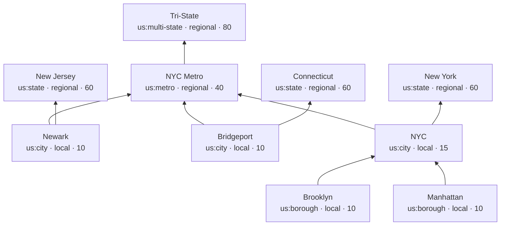
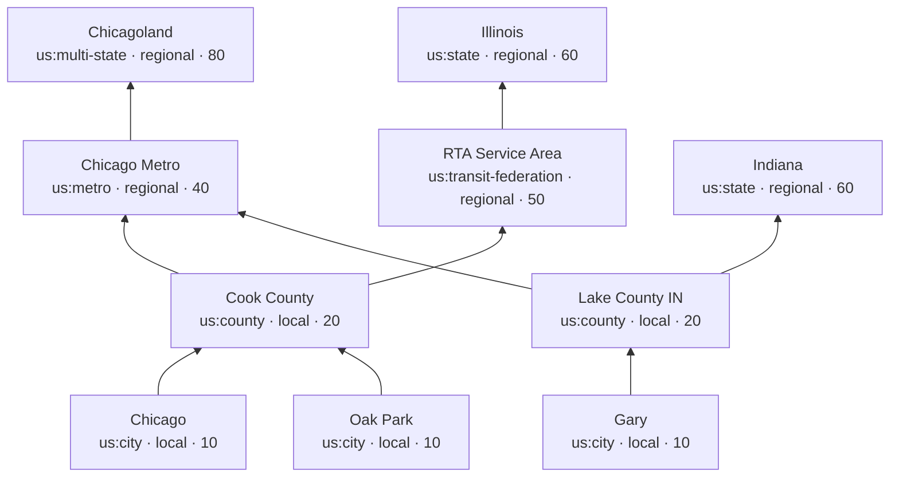
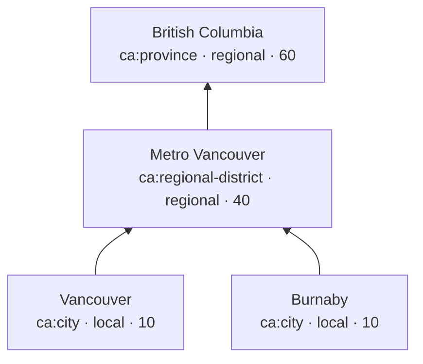
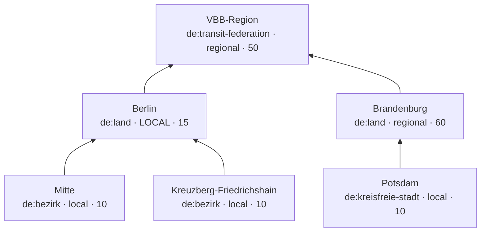

# Region graph — design spec

**Status:** Approved (2026-05-16). Implementation plan pending (`writing-plans`).
**Slice:** Roadmap #4.5 — *Region-graph refactor*. Lands between Phase 1 launch (US + CA, locked-down dogfooding) and Phase 2 cutover (public free-key API + rate limits). The first European country (likely Germany, France, or similar — trial only) lands as slice #4.6 immediately after this refactor.

---

## Context

The v1 data model assumes US/CA-shaped geography baked in three places:

1. **Closed `RegionKind` enum** on the wire and in code: `city | county | metro | state | province | country | multi-state`. Any country with a kind we haven't enumerated (UK *unitary authority*, German *Kreis*, Japanese *prefecture*, French *commune*, French *métropole*, Australian *LGA*) requires a spec edit + regen on both halves.
2. **Flat 4-slot denormalization** on `postal_codes` (`city_region_id`, `county_region_id`, `metro_region_id`, `state_region_id`). This masquerades as the canonical model but is really a cache of "the 4 most relevant ancestors of this ZIP." It assumes every postal code has exactly four meaningful tiers; Germany has Gemeinde→(Kreis?)→Land→Bund with the Kreis optional in city-states; the UK has town→district→county→region→nation; France has commune→département→région plus métropoles that overlap départements; some structures have 2 tiers, some have 5, some have *overlapping* groupings (Métropole de Lyon overlaps départements; Detroit–Windsor crosses a national border).
3. **`scope_tier` derived from `kind`** in `loadpostal`. The decision *"city/county are local; metro/state are regional"* only makes sense for US/CA. Berlin is a *Land* (state-equivalent) but functions as a city. Most German Länder need to bucket as regional; Berlin/Hamburg/Bremen need to bucket as local. Hardcoded derivation can't express that.

The third country is imminent (2–3 months) and European, which stresses the schema hardest. This spec replaces the data model with a region graph that handles arbitrary administrative hierarchies, advocacy-defined regions (transit federations, multi-state coalitions), and per-region scope decisions — without any country-specific code paths.

## Goals

- **Model arbitrary geographic hierarchies** across countries: variable depth, optional middle tiers, overlapping groupings, multi-parent regions.
- **Decouple `scope_tier` from `kind`** so per-region exceptions (Berlin-as-Land bucketing local) cost a data edit, not a code change.
- **First-class advocacy regions**: NYC Tri-State, Chicago RTA service area, Berlin's VBB transit federation. Today these are inexpressible.
- **Open the wire vocabulary** for `RegionKind` and `Country` so adding a country never requires a spec edit.
- **Preserve `LookupResult`'s two-bucket shape** (`local` / `regional`). The bucketing rule changes mechanism; the user-facing semantics don't.
- **Make bucketing explainable** via `matched_region_slugs` on each returned org; make breadcrumbs cheap via `resolved_ancestry` on the lookup response.
- **Document the model thoroughly** so future curators can add a country without re-deriving the modeling conventions.

## Non-goals

- A public graph-browsing endpoint (`/api/v1/regions/{slug}`). Deferred to the slice that needs it (likely #14 metro detail pages).
- `children_slugs` on `Region`. Add when a client needs it.
- A regions admin UI. Curation stays file-based (TOML/CSV).
- Caching ancestor walks (materialized `postal_codes_regions` view). Add when measurement says it's needed.
- Migrating countries beyond US/CA in this slice. That's slice #4.6.

---

## Data model

Three schema changes; everything else hangs off these.

### `regions` (modified)

```sql
CREATE TABLE regions (
    id BIGSERIAL PRIMARY KEY,
    country TEXT NOT NULL,
    kind TEXT NOT NULL,                            -- free-form: 'us:city', 'de:land', 'fr:metropole', ...
    name TEXT NOT NULL,
    slug TEXT NOT NULL UNIQUE,                     -- globally unique across countries
    scope_tier TEXT NOT NULL CHECK (scope_tier IN ('local', 'regional')),
    sort_priority INT NOT NULL DEFAULT 50          -- lower = more specific = sorts earlier within bucket
);
```

`kind` is `TEXT` with no CHECK — adding a new country never requires a migration. The vocabulary lives in the seed README and in `docs/region-graph.md`.

`scope_tier` is the only closed enum on the wire. The two-bucket invariant is load-bearing for the API contract; if we ever need a third tier, that's a major-version event.

`sort_priority` is a server-side hint, not on the wire. Lower = more specific = sorts earlier within the Regional bucket. Recommended ranges:

| Range | Tier examples |
|---|---|
| 10 | borough, neighborhood |
| 15 | consolidated city (NYC), city-state acting as city (Berlin) |
| 20 | county |
| 40 | metro |
| 50 | transit federation, RTA-style region |
| 60 | state, province, Land |
| 80 | multi-state, multi-province, multi-Land |

### `region_parents` (new)

```sql
CREATE TABLE region_parents (
    region_id BIGINT NOT NULL REFERENCES regions(id) ON DELETE CASCADE,
    parent_region_id BIGINT NOT NULL REFERENCES regions(id) ON DELETE CASCADE,
    PRIMARY KEY (region_id, parent_region_id),
    CHECK (region_id <> parent_region_id)
);
CREATE INDEX region_parents_parent_idx ON region_parents(parent_region_id);
```

A region may have multiple parents (the model is a DAG, not a tree). Postgres-level CHECK blocks self-loops; longer cycles are caught at write-time in `loadregions` via DFS over the staged graph.

### `postal_codes` (simplified)

```sql
CREATE TABLE postal_codes (
    postal_code TEXT NOT NULL,
    country TEXT NOT NULL,
    leaf_region_id BIGINT NOT NULL REFERENCES regions(id) ON DELETE RESTRICT,
    PRIMARY KEY (postal_code, country)
);
CREATE INDEX postal_codes_leaf_idx ON postal_codes(leaf_region_id);
```

A postal code points to its *leaf* region only. Ancestor walk happens at lookup time.

### `organization_regions` (unchanged)

Still a flat m:n between orgs and regions. An org can attach to any node in the graph — leaf city, intermediate metro, multi-state region, transit federation — and the lookup mechanism handles the rest.

---

## Modeling conventions

These are conventions, not constraints. They're the things you have to know to model a country well; without them the graph is permissive enough to produce wrong results.

### 1. State edges live on the leaf, not on the metro

When a metro spans multiple states (NYC across NY+NJ+CT, Chicago across IL+IN+WI), do **not** parent the metro under all three states. Instead, parent each leaf city (Brooklyn, Hoboken, Bridgeport) directly under its own state.

Why: if `nyc-metro → {ny, nj, ct}`, then a Brooklyn lookup walks `brooklyn → nyc-metro → {nj, ct}`, incorrectly inheriting NJ and CT as ancestors. The walk picks up *all* ancestors transitively.

### 2. Multi-state / federation regions parent the metro or the leaf, not the state

`nyc-tristate` is a parent of `nyc-metro`, not of NY/NJ/CT. Likewise, `chicagoland-multistate` is a parent of `chicago-metro`. The rule: federations and multi-state regions sit *above* the metro tier (or directly above leaves), never above the state tier.

Why: if `nyc-tristate → ny`, then a Buffalo ZIP (in NY but not in the Tri-State advocacy area) would inherit `nyc-tristate` as an ancestor — wrong.

### 3. Transit federations are siblings of states, parented under the leaves they serve

Chicago's RTA service area covers Cook + 5 collar counties — all in Illinois. Model it as a top-level region; parent each RTA county (cook-county, dupage-county, etc.) under it. A Cook County lookup walks `cook-county → rta-service-area`. A Gary IN lookup never touches `rta-service-area` because Gary's county is parented under IN, not RTA.

Berlin's VBB-region similarly: a top-level region; both `berlin` and `brandenburg` have it as a parent. A Berlin or Brandenburg lookup surfaces VBB-attached orgs; a Bavarian lookup does not.

### 4. `scope_tier` is editorial, not derived

Berlin is `kind='de:land'` (formally correct) but `scope_tier='local'` (functionally correct — Berliners experience it as a city). The maintainer makes this judgment per region. Other German Länder (Bayern, NRW, …) get `scope_tier='regional'`.

### 5. No country regions in v1

National orgs are explicitly out of scope (CLAUDE.md). The graph stops at state/Land/multi-state/federation tier — no `us`, `ca`, `de` rows. National orgs literally have no v1 region to attach to.

### 6. Abstract regions don't need postal codes pointing at them

`nyc-tristate` and `vbb-region` are interior nodes with no postal codes attached directly. The ancestor walk reaches them through their children (`nyc-metro` → `nyc-tristate`; `berlin` → `vbb-region`). This is correct and intentional.

---

## Worked examples

### NYC — multi-state metro + multi-state advocacy region



Postal codes: `11217 → brooklyn`, `10001 → manhattan`, `07302 → hoboken`, `06604 → bridgeport`.

Sample orgs:

| Org | `region_slugs` |
|---|---|
| Brooklyn Spoke | `["brooklyn"]` |
| Transportation Alternatives | `["nyc"]` |
| StreetsPAC | `["nyc"]` |
| TransitCenter | `["nyc-metro"]` |
| Regional Plan Association | `["nyc-metro"]` |
| NY LCV Transportation | `["ny"]` |
| Tri-State Transportation Campaign | `["nyc-tristate"]` |

**Lookup `11217 US` (Park Slope):**

- Ancestor walk: `brooklyn → nyc → {nyc-metro, ny} → nycmetro → nyc-tristate` ⇒ `{brooklyn, nyc, nyc-metro, ny, nyc-tristate}`
- **Local:** Brooklyn Spoke (10), then TransAlt + StreetsPAC (15)
- **Regional:** TransitCenter + RPA (40), NY LCV Transportation (60), Tri-State (80)

**Lookup `07302 US` (Hoboken NJ):**

- Ancestor set: `{hoboken, nyc-metro, nj, nyc-tristate}`
- **Local:** Hoboken-specific orgs only — *TransAlt does NOT appear* (attached to `nyc`, not in Hoboken's ancestor set).
- **Regional:** TransitCenter + RPA, Tri-State.

This is the bucketing the current model gets wrong. The new model is correct by construction.

### Chicago — transit federation carves out an IL-only sub-region



**Lookup `60601 US` (Chicago Loop):**

- Ancestor set: `{chicago, cook-county, chicago-metro, rta-service-area, il, chicagoland-multistate}`
- **Local:** Better Streets Chicago (10).
- **Regional:** ATA + Streetsblog (40), RTA Riders (50), Illinois Walks (60).

**Lookup `46402 US` (Gary IN):**

- Ancestor set: `{gary, lake-county-in, chicago-metro, in, chicagoland-multistate}`
- **Local:** Gary-specific orgs only.
- **Regional:** ATA + Streetsblog (chicago-metro). *RTA Riders does NOT appear* — `rta-service-area` is parented under IL, not under `chicago-metro`. Correct: RTA doesn't serve Indiana.

### Vancouver — no county layer; regional district stands in



The model gracefully omits tiers that don't exist for a country — no null FK slots, no empty `county_region_id` columns.

**Lookup `V6B CA`:**

- Ancestor set: `{vancouver, metro-vancouver, bc}`
- **Local:** Walk Vancouver (10).
- **Regional:** HUB Cycling + Movement (40), BC Cycling Coalition (60).

### Berlin — city-state + transit federation spanning Länder



Note `berlin.scope_tier = local` even though `kind = de:land`. The explicit scope_tier override is exactly the affordance that makes city-states tractable.

**Lookup `10115 DE` (Berlin-Mitte):**

- Ancestor set: `{mitte, berlin, vbb-region}`
- **Local:** ADFC Mitte (10), Changing Cities + IGEB (15).
- **Regional:** VBB-Fahrgastverband (50). *BUND Brandenburg does NOT appear*.

**Lookup `14467 DE` (Potsdam, Brandenburg):**

- Ancestor set: `{potsdam, brandenburg, vbb-region}`
- **Local:** Potsdam-specific only. *Changing Cities and IGEB do NOT appear* — Brandenburg lookups don't walk through `berlin`.
- **Regional:** VBB-Fahrgastverband (50), BUND Brandenburg (60).

---

## Lookup algorithm

```
1. ResolvePostalCode(country, code) → Region (leaf only; 404 if unknown)
2. AncestorRegions(leafID) → []Region  // recursive CTE, includes leaf
3. OrgsForRegions(ancestorIDs) → []Org  // each Org carries its full attachment list
4. For each org:
     matched = org.AttachedRegionIDs ∩ ancestorIDs
     hasLocal = any(matched.region.scope_tier == 'local')
     bestSort = min(matched.region.sort_priority)
     bucket = Local if hasLocal else Regional
5. Sort within each bucket by (bestSort asc, org.Name asc)
```

The current code's Item-1 sort bug — computing `mostSpecificRank` over the org's full region list — goes away by construction. `bestSort` is computed over the *matched* subset only.

### Recursive CTE

```sql
WITH RECURSIVE ancestors AS (
  SELECT id, kind, name, slug, country, scope_tier, sort_priority
    FROM regions WHERE id = $1                   -- the leaf
  UNION                                            -- dedupes DAG diamonds
  SELECT r.id, r.kind, r.name, r.slug, r.country, r.scope_tier, r.sort_priority
    FROM regions r
    JOIN region_parents rp ON rp.parent_region_id = r.id
    JOIN ancestors a       ON rp.region_id = a.id
)
SELECT * FROM ancestors;
```

`UNION` (not `UNION ALL`) is load-bearing: it dedupes when a DAG has multiple paths to the same ancestor, and gives Postgres the termination signal when no new rows appear.

### Error and edge cases

| Case | Handling |
|---|---|
| Postal code not in `postal_codes` | `ErrPostalCodeNotFound` → 404 with RFC 9457 problem `postal-code-not-found` (unchanged from today). |
| Leaf region row deleted | Prevented by `ON DELETE RESTRICT` on `postal_codes.leaf_region_id`. Defensive 500 if the CTE returns 0 rows anyway. |
| Region has no parents (top-of-tree) | Valid. Ancestor set = `{leaf}`. |
| Leaf has `scope_tier='regional'` (rare — e.g. a postal code that's directly a regional district leaf) | Org attached to the leaf lands in Regional. No special case. |
| Cycle in `region_parents` (corrupt data) | `UNION` dedup terminates the CTE; result includes cycle members. **Prevention** at `loadregions` time via DFS over staged graph. Postgres-level CHECK only catches self-loops. |
| Org attached to a region with no postal codes in ancestry path | Org exists but never surfaces. Curation issue, not a code bug. |

### Performance

For a typical lookup the ancestor set is 3–7 rows; `OrgsForRegions` returns 5–50 orgs; the bucket + sort step is O(orgs × matched), trivially fast. Recursive CTE on a graph of ~hundreds of `region_parents` rows is microseconds.

No caching needed for v1. If measurement later says otherwise, the natural optimization is materializing `postal_codes_regions(postal_code, country, region_id)` at `loadpostal` time — additive, no code paths break.

### `placeLabel` heuristic

```
leaf = ancestry[0]
localAncestor = first ancestor where scope_tier='local' and slug != leaf.slug, or nil
regionalAncestor = first ancestor where scope_tier='regional', or nil

if localAncestor and regionalAncestor:
  return "<leaf.name>, <localAncestor.name> — <regionalAncestor.name>"
if regionalAncestor:
  return "<leaf.name> — <regionalAncestor.name>"
return leaf.name
```

Examples:
- NYC `11217`: leaf=Brooklyn, local-ancestor=NYC, regional-ancestor=NYC Metro → **"Brooklyn, NYC — New York Metro"**
- Berlin `10115`: leaf=Mitte, local-ancestor=Berlin, regional-ancestor=VBB-Region → **"Mitte, Berlin — VBB-Region"**
- Vancouver `V6B`: leaf=Vancouver, no separate local-ancestor, regional-ancestor=Metro Vancouver → **"Vancouver — Metro Vancouver"**

Clients with stronger opinions can roll their own from `resolved_ancestry`.

---

## File formats and tooling

### File split

| File | Format | Cardinality | Source | Edit cadence |
|---|---|---|---|---|
| `regions_<cc>.toml` | TOML | ~100 rows/country | Hand-curated editorial | Frequent |
| `postal_codes_<cc>.csv` | CSV | 10k–50k rows/country | Census/StatsCan/Royal Mail/etc., reshaped by ETL | Rare |
| `orgs.toml` | TOML | ~15-50 rows initially, growing | Hand-curated editorial | Frequent |

TOML for hand-curated entities (regions + orgs); CSV for bulk machine-generated mappings. The two formats reflect editing reality — TOML is type-rigorous and comment-friendly; CSV is the right shape for 40k flat rows.

Dependency change: drop `gopkg.in/yaml.v3`, add `github.com/pelletier/go-toml/v2`. One-for-one swap. CLAUDE.md's approved-deps list updates accordingly.

### `regions_us.toml` schema

```toml
# Region taxonomy for the United States.
# Each [[region]] entry creates one row in `regions`; the `parents` array
# creates rows in `region_parents`. A region may appear before its parents
# in the file — loadregions resolves slugs after parsing.
#
# Recommended sort_priority ranges:
#   10  borough/neighborhood
#   15  consolidated city
#   20  county
#   40  metro
#   50  transit federation / RTA-style region
#   60  state / province
#   80  multi-state / multi-province

[[region]]
slug = "brooklyn"
kind = "us:borough"
name = "Brooklyn"
scope_tier = "local"
sort_priority = 10
parents = ["nyc"]

[[region]]
slug = "nyc"
kind = "us:city"
name = "New York City"
scope_tier = "local"
sort_priority = 15
parents = ["nyc-metro", "ny"]

[[region]]
slug = "nyc-metro"
kind = "us:metro"
name = "New York Metro"
scope_tier = "regional"
sort_priority = 40
parents = ["nyc-tristate"]

[[region]]
slug = "ny"
kind = "us:state"
name = "New York"
scope_tier = "regional"
sort_priority = 60
parents = []

[[region]]
slug = "nyc-tristate"
kind = "us:multi-state"
name = "Tri-State Region (NY/NJ/CT)"
scope_tier = "regional"
sort_priority = 80
parents = []
```

### `postal_codes_us.csv` schema

```csv
postal_code,country,leaf_region_slug
11217,US,brooklyn
11215,US,brooklyn
10001,US,manhattan
07302,US,hoboken
60601,US,chicago
46402,US,gary
```

Three columns. The `country` column is redundant with the `--country` CLI flag but kept for self-documenting CSVs and to catch accidental cross-country files.

### `orgs.toml` schema

```toml
[[org]]
slug = "transportation-alternatives"
name = "Transportation Alternatives"
short_desc = "NYC's largest streets-and-mobility advocacy organization, pushing for safer streets, better transit, and protected bike infrastructure."
website_url = "https://transalt.org"
contact_url = "https://transalt.org/contact"
tags = ["advocacy", "safe-streets", "cycling", "walking", "vision-zero"]
region_slugs = ["nyc"]

[[org]]
slug = "tri-state-transportation-campaign"
name = "Tri-State Transportation Campaign"
short_desc = "Policy coalition advocating for sustainable transportation across New York, New Jersey, and Connecticut."
website_url = "https://tstc.org"
tags = ["transit", "policy", "regional"]
region_slugs = ["nyc-tristate"]

[[org]]
slug = "changing-cities"
name = "Changing Cities"
short_desc = """
Berlin-wide cycling and streets-reform organization, behind the city's \
Volksentscheid Fahrrad campaign and the Mobilitätsgesetz Berlin.
"""
website_url = "https://changing-cities.org"
tags = ["cycling", "safe-streets", "advocacy", "policy"]
region_slugs = ["berlin"]
```

`region_slugs` is a flat list — country is implicit in each region row (slugs are globally unique). Cross-country attachment is supported by the model but not used by curated v1 orgs.

### Subcommands

```
loadregions --src api/seed/regions_us.toml --country US
loadpostal  --src api/seed/postal_codes_us.csv --country US
seed                                                       # reads api/seed/orgs.toml
```

All three idempotent, all three single-transaction. Order matters: regions → postal_codes → seed. FKs enforce the ordering — wrong order produces loud errors, not silent corruption.

### Cycle detection

`loadregions` stages all regions and parent edges in memory before writing. After staging, DFS over the staged graph with 3-coloring (white/gray/black); a gray-node revisit means a cycle. Error format:

```
loadregions: cycle detected in parent graph:
  brooklyn → nyc → nyc-metro → brooklyn
fix the parents: field on one of these regions.
```

Transaction rolls back on cycle.

### Per-country postal-code normalization

In `pkg/atlas/postal.go`:

```go
func normalizePostalCode(c Country, raw string) string {
    s := strings.ToUpper(strings.TrimSpace(strings.ReplaceAll(raw, " ", "")))
    switch c {
    case CountryUS, CountryDE, CountryFR, CountryMX:
        return s                          // numeric, no further normalization
    case CountryCA:
        if len(s) > 3 { return s[:3] }    // truncate to FSA
        return s
    case CountryUK:
        if len(s) > 3 { return s[:len(s)-3] }   // outward code only
        return s
    case CountryAU:
        return s                           // 4-digit
    }
    return s
}
```

Plus `validatePostalCode(c, s) error` enforcing length + character class per country. `Country` opens to free-form string with documented well-known values.

### Justfile

```just
loadregions src country:
    cd api && go run ./cmd/server loadregions --src {{src}} --country {{country}}

loadpostal src country:
    cd api && go run ./cmd/server loadpostal --src {{src}} --country {{country}}

loaddata:
    just loadregions seed/regions_us.toml US
    just loadpostal  seed/postal_codes_us.csv US
    just loadregions seed/regions_ca.toml CA
    just loadpostal  seed/postal_codes_ca.csv CA
    just seed
```

`loaddata` is shell orchestration only — not a Go subcommand. Same instinct as `just ci`.

---

## Wire contract

Spec version stays at `1.0.0`. Pre-launch design iteration; semver bumps start at Phase 1 launch.

### `RegionKind` opens

```yaml
RegionKind:
  type: string
  description: |
    Free-form taxonomy for region granularity. Recommended vocabulary uses
    country-prefixed values: 'us:city', 'us:borough', 'us:county', 'us:metro',
    'us:state', 'us:multi-state', 'us:transit-federation', 'ca:province',
    'ca:regional-district', 'ca:city', 'de:land', 'de:bezirk',
    'de:kreisfreie-stadt', 'de:transit-federation', 'fr:commune',
    'fr:departement', 'fr:region', 'fr:metropole'. Clients should treat
    unknown kinds gracefully (e.g. fall back to display the `name`).
  examples: ['us:city', 'us:metro', 'de:land', 'fr:metropole']
```

### `Country` opens similarly

```yaml
Country:
  type: string
  description: |
    ISO-style country code. v1 ships with 'US' and 'CA'; additional
    countries are added without spec changes as data is loaded.
  examples: ['US', 'CA', 'DE']
```

### `Region` gains `parent_slugs`

```yaml
Region:
  type: object
  required: [id, kind, name, slug, country, scope_tier]
  properties:
    id:            { type: integer, format: int64 }
    kind:          { $ref: '#/components/schemas/RegionKind' }
    name:          { type: string }
    slug:          { type: string, description: "Globally unique across countries." }
    country:       { $ref: '#/components/schemas/Country' }
    scope_tier:    { type: string, enum: [local, regional] }
    parent_slugs:
      type: array
      items: { type: string }
      description: |
        Direct parents in the region graph (not transitive). Empty for
        top-of-hierarchy regions. Clients can walk these to render
        breadcrumbs without a second request.
```

`scope_tier` stays a *closed* enum. The two-bucket invariant is the one API-contract place we defend at the type system level. `sort_priority` is server-side only.

### `ResolvedPostalCode` deleted

The 4-slot model leaks into the contract via this schema. We delete it; information moves into `LookupResult.resolved_ancestry` and `LookupResult.resolved_place_label`.

### `LookupResult` gains `resolved_ancestry`; orgs become `LookupOrg`

```yaml
LookupResult:
  type: object
  required: [query, resolved_place_label, resolved_ancestry, local, regional]
  properties:
    query:                 { $ref: '#/components/schemas/LookupQuery' }
    resolved_place_label:  { type: string, example: "Brooklyn, NYC — New York Metro" }
    resolved_ancestry:
      type: array
      items: { $ref: '#/components/schemas/Region' }
      description: |
        The leaf region for this postal code followed by all ancestors,
        ordered most-specific first.
    local:    { type: array, items: { $ref: '#/components/schemas/LookupOrg' } }
    regional: { type: array, items: { $ref: '#/components/schemas/LookupOrg' } }
```

### `LookupOrg` extends `Org` with `matched_region_slugs`

```yaml
LookupOrg:
  allOf:
    - $ref: '#/components/schemas/Org'
    - type: object
      required: [matched_region_slugs]
      properties:
        matched_region_slugs:
          type: array
          items: { type: string }
          minItems: 1
          description: |
            Slugs of the regions whose membership caused this org to surface
            for the current lookup. Always a non-empty subset of the org's
            `regions[*].slug`.
```

### Worked example response — `GET /api/v1/lookup?postal_code=11217&country=US`

```json
{
  "query": { "postal_code": "11217", "country": "US" },
  "resolved_place_label": "Brooklyn, NYC — New York Metro",
  "resolved_ancestry": [
    { "id": 12, "kind": "us:borough", "name": "Brooklyn",
      "slug": "brooklyn", "country": "US", "scope_tier": "local",
      "parent_slugs": ["nyc"] },
    { "id":  8, "kind": "us:city", "name": "New York City",
      "slug": "nyc", "country": "US", "scope_tier": "local",
      "parent_slugs": ["nyc-metro", "ny"] },
    { "id":  4, "kind": "us:metro", "name": "New York Metro",
      "slug": "nyc-metro", "country": "US", "scope_tier": "regional",
      "parent_slugs": ["nyc-tristate"] },
    { "id":  2, "kind": "us:state", "name": "New York",
      "slug": "ny", "country": "US", "scope_tier": "regional",
      "parent_slugs": [] },
    { "id":  1, "kind": "us:multi-state", "name": "Tri-State Region (NY/NJ/CT)",
      "slug": "nyc-tristate", "country": "US", "scope_tier": "regional",
      "parent_slugs": [] }
  ],
  "local": [
    {
      "slug": "transportation-alternatives",
      "name": "Transportation Alternatives",
      "short_desc": "NYC's largest streets-and-mobility advocacy organization...",
      "website_url": "https://transalt.org",
      "tags": ["advocacy", "safe-streets", "cycling", "walking", "vision-zero"],
      "regions": [/* ...org's full attachment list... */],
      "matched_region_slugs": ["nyc"]
    }
  ],
  "regional": [
    { "slug": "transitcenter",                       "...": "...", "matched_region_slugs": ["nyc-metro"] },
    { "slug": "tri-state-transportation-campaign",   "...": "...", "matched_region_slugs": ["nyc-tristate"] }
  ]
}
```

### No new RFC 9457 error types

The closed `scope_tier` enum + FK constraints make server-side invariants tight enough that the existing error catalog covers everything.

### Generated-code regen

Both halves regenerate from the updated spec via existing `just api-oapi-gen` / `npm run generate:api`. The TS side gets nicer types (open `kind` is more permissive than the closed enum; no exhaustive-switch breakages). The Go side gets `oapi.RegionKind = string` which is a one-character diff in `lib/api.ts` callers (effectively zero). The embedded-copy sync (`internal/httpapi/openapi.yaml`) regenerates via the existing `go generate` directive.

---

## Documentation deliverable

This slice ships **`docs/region-graph.md`** as a first-class artifact:

- Full design rationale (compressed from this spec).
- Mermaid diagrams for each of the worked cities (NYC, Chicago, Vancouver, Berlin).
- The modeling conventions section verbatim ("state edges live on the leaf," "federations parent the metro not the state," etc.) — these are non-obvious and hard to re-derive.
- A step-by-step "adding a new country" howto with a Germany worked example: write `regions_de.toml`, fetch & reshape postal-code data into `postal_codes_de.csv`, add DE orgs to `orgs.toml`, run `just loaddata`.
- Cross-link from `CLAUDE.md` (in the Data shape section) and from `docs/roadmap.md` (under slice #4.5).
- Cross-link from `api/seed/README.md` (the operational angle: where seed data comes from, format references).

The user explicitly flagged thorough documentation as a load-bearing deliverable. The diagrams are the part that pays the most back; without them the modeling conventions read as abstract rules rather than concrete shapes.

---

## Migration plan

### Pre-conditions

- Agent A's branch (`worktree-agent-a79018c2c6524055c`) and Agent B's branch (`worktree-agent-a57e74c54e0adf3c2`) merged to main.
- Item 1 hotfix (per-block `scope` flag) **skipped** — this slice supersedes the linkage model entirely; the bug is structurally impossible in the new model.
- Phase 1 dogfood may be live with US/CA seed data; the migration safely wipes regions + postal_codes and re-seeds.

### Step-by-step execution

| # | Step | Files | Cost |
|---|---|---|---|
| 1 | Spec edits: open `RegionKind` + `Country`, delete `ResolvedPostalCode`, add `parent_slugs` to `Region`, add `resolved_ancestry` to `LookupResult`, introduce `LookupOrg`. Regen Go + TS types. | `api/openapi.yaml`, `api/internal/httpapi/openapi.yaml`, `api/internal/httpapi/oapi/types.gen.go`, `web/src/lib/api.gen.ts` | 1 commit, ~250 LOC mostly generated |
| 2 | Schema migration `0002_region_graph.sql`: add `region_parents`; alter `regions` (add `sort_priority`, drop `kind` CHECK); alter `postal_codes` (add `leaf_region_id`, drop 4 tier FKs). Wipe-and-reseed disclaimer in the migration comment. | `api/migrations/0002_region_graph.sql`, `api/migrations/embed.go` regen | 1 commit |
| 3 | Swap YAML → TOML dep: drop `gopkg.in/yaml.v3`, add `github.com/pelletier/go-toml/v2`. Update CLAUDE.md approved-deps. | `api/go.mod`, `api/go.sum`, `CLAUDE.md` | Tiny commit |
| 4 | `loadregions` subcommand: parse TOML, stage in memory, cycle-detect, write inside one `pgx.Tx`. Helpful errors with "did you mean" suggestions. Unit tests on cycle detection + TOML parsing. | `api/cmd/server/loadregions.go`, `api/internal/loadregions/{toml.go,validate.go,write.go}`, tests | 1 commit, ~400 LOC |
| 5 | Rewrite `loadpostal`: 3-column CSV, single FK to leaf region, idempotent upserts. Per-country normalization in `pkg/atlas/postal.go`. | `api/cmd/server/loadpostal.go`, `api/internal/loadpostal/csv.go`, `api/pkg/atlas/postal.go`, tests | 1 commit, ~200 LOC mostly delete+rewrite |
| 6 | Rewrite `seed` loader for TOML + `region_slugs`. Same transactional wholesale-replace pattern as today. | `api/internal/seed/orgs.go`, tests | 1 commit, ~150 LOC |
| 7 | New `Store` methods: `ResolveLeafRegion`, `AncestorRegions` (recursive CTE), `OrgsForRegions`. Update `MemStore` to match (in-memory graph walk). | `api/internal/store/postgres/{store.go,queries/lookup.sql,gen/*}`, `api/pkg/atlas/{store.go,memstore.go}`, tests | 1 commit, ~300 LOC |
| 8 | Rewrite `pkg/atlas/lookup.go` per the new algorithm. New `placeLabel` heuristic. Unit tests covering NYC + Chicago + Vancouver + Berlin worked examples to pin the bucketing. | `api/pkg/atlas/lookup.go`, `api/pkg/atlas/lookup_test.go` | 1 commit, ~250 LOC |
| 9 | Hand-write curated taxonomy: `seed/regions_us.toml` + `seed/regions_ca.toml` (~35 region rows). Convert `seed/test_postal_us.csv` and `seed/test_postal_ca.csv` to 3-column shape. Rewrite `seed/orgs.yaml` → `seed/orgs.toml` with `region_slugs`, applying curation insight per worked examples. | `api/seed/regions_us.toml`, `api/seed/regions_ca.toml`, `api/seed/postal_codes_us.csv`, `api/seed/postal_codes_ca.csv`, `api/seed/orgs.toml` | 1 commit, ~45 min curation |
| 10 | Justfile: replace `loadpostal` recipe with `loadregions` + new `loadpostal`, add `loaddata`. Update `api/seed/README.md`. | `justfile`, `api/seed/README.md` | Tiny commit |
| 11 | SPA: consume `resolved_ancestry` for Dateline breadcrumbs. Consume `matched_region_slugs` for "via X" subtitles on each Entry. Verify open `kind` doesn't break any narrowed types. | `web/src/components/Dateline.tsx`, `web/src/components/Entry.tsx`, `web/src/routes/Results.tsx` | 1 commit, ~80 LOC |
| 12 | **Documentation**: `docs/region-graph.md` per the deliverable section above (rationale + mermaid diagrams + modeling conventions + "adding a country" howto). Cross-link from CLAUDE.md, roadmap.md, and seed/README.md. | `docs/region-graph.md`, `CLAUDE.md`, `docs/roadmap.md`, `api/seed/README.md` | 1 commit, the most user-facing artifact |
| 13 | Integration test: extend `pipeline_test.go` to cover worked-city lookups (11217 → TransAlt Local + Tri-State Regional; 14467 → no Berlin orgs surface; 46402 → no RTA orgs). | `api/internal/store/postgres/pipeline_test.go` | Tiny commit |
| 14 | Roadmap edit: insert this slice as #4.5, add #4.6 (first EU country trial). | `docs/roadmap.md` | Tiny commit |

Total: **14 commits**, mostly small, plus one curation work-item. End-to-end estimate: **2–3 days of focused work** plus the documentation pass.

### Risk mitigations

- **Wipe-and-reseed migration**: the migration script comments explicitly say *"drops all data in regions, region_parents, postal_codes — re-run `just loaddata` after applying."* Safe pre-Phase-1 (no real data) and pre-Phase-2 (only dogfood data). Not safe after Phase 2 — that's when proper backfill migrations start mattering.
- **Generated-code drift**: existing `just api-check` runs `api-gen-check`, which fails CI if regen produces a diff. Catches forgotten regens automatically.
- **Cycle bugs in seed data**: caught at `loadregions` write-time with a clear error, not at lookup time.
- **Unknown-slug bugs in orgs.toml**: caught at `seed` time with "did you mean" suggestions.
- **Hot-path performance regression**: integration test asserts a real lookup completes inside a generous deadline (single-digit ms).

### Roadmap positioning

```
Done so far:        #1 #2 #3 #4 #8 #9 #10
This slice:         #4.5  region-graph refactor (this spec)
Phase 1 lockdown:   #22 CORS, #23 shared secret, #24 ODbL attribution
[Phase 1 launch — urbanistatlas.com live, US+CA, frontend-only consumers]
Then:               #4.6  first EU country trial (regions_de.toml + postal_codes_de.csv + DE orgs)
Continue features:  #5 submissions, #6 metros/recent
[Phase 2 cutover — #26 #27 #28: API keys, rate limits, public-key launch]
```

The EU country (#4.6) lands **after** the structural refactor and **before** Phase 2 cutover. We validate the model with a real second-region-system dataset before locking the contract for public consumers.

---

## Open questions

None at design-doc commit time. All decisions resolved in brainstorming:

- Approach A (region graph) chosen over B (m:n bag) and C (open enum only).
- Two-file split (`regions_<cc>.toml` + `postal_codes_<cc>.csv`) chosen over single combined file.
- Two subcommands (`loadregions` + `loadpostal`) chosen over one combined.
- TOML for both regions and orgs files (consistent format).
- Spec version stays at `1.0.0` through this slice.
- Item 1 hotfix skipped (superseded by this slice).

If implementation surfaces questions, they get added here as the spec is referenced.
